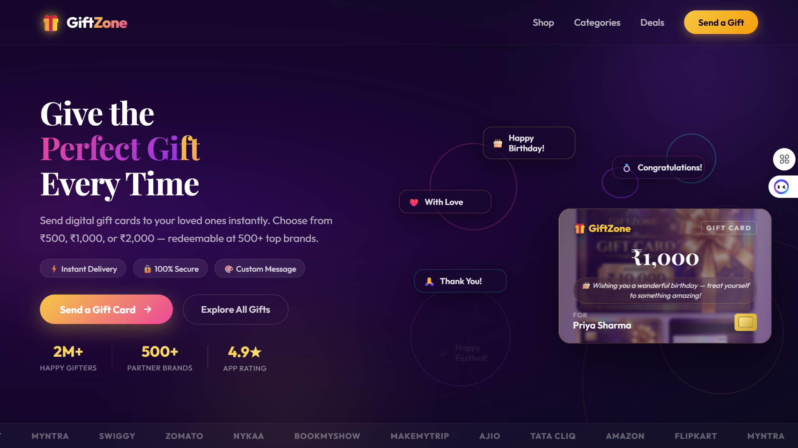
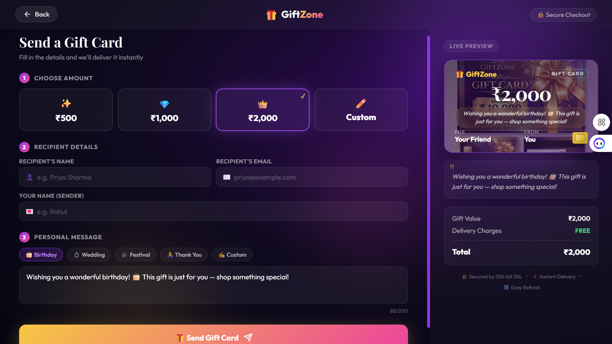
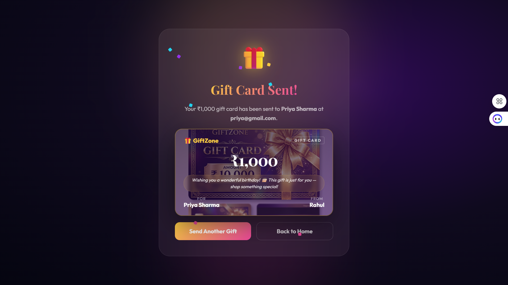

# 🎁 GiftZone - Premium Gift Card Application

Welcome to **GiftZone**, a premium, interactive web application designed for sending digital gift cards. This document details the application's features, architecture, design choices, and implementation details.

---

## 🌟 Project Overview
GiftZone is a modern React web application built with a focus on **visual excellence** and **smooth user experience**. It allows users to browse occasion cards, customize details (recipient name, sender name, amount, and personal message), see updates in real-time, and experience a celebratory success state when the card is "sent."

### 📸 Screenshots
| Landing Home Page | Customization & Live Preview | Sent Success Card |
| :---: | :---: | :---: |
|  |  |  |

---

## 🚀 Key Features

### 1. Interactive Hero Section
* **Showcase Gift Card**: Displays a premium gift card mockup with a dynamic shimmer effect, custom amounts, names, and messages.
* **Animated Floating Rings**: Rotating, glowing decorative rings in the background of the hero section add depth and movement.
* **Floating Occasion Cards**: Five mini occasion cards (Birthday, Wedding, Festival, Thank You, and Love) fade in sequentially and float around the screen at non-overlapping positions to represent the versatility of GiftZone.

### 2. Flexible Denominations & Custom Pricing
* **Preset Cards**: Choose quickly between standard card denominations: **Silver (₹500)**, **Gold (₹1,000)**, and **Platinum (₹2,000)**.
* **Custom Amount Card**: A dedicated "Custom" option that reveals an inline input field. It features real-time validation restricting values between **₹100** and **₹50,000**.

### 3. Real-Time Live Preview
* As users enter recipient names, sender names, custom prices, and personal messages, the **Live Preview Card** updates instantly.
* The preview card matches the selected card theme (Silver, Gold, Platinum, or Custom Cyan) with corresponding borders and ambient glow.

### 4. Smart Occasions & Character Count
* Quick-select pills automatically fill standard greetings for **Birthday**, **Wedding**, **Festival**, and **Thank You** occasions.
* Users can type custom messages, complete with a character counter showing limit validation (up to 200 characters).

### 5. Celebratory Success Screen (Sent State)
* Includes an animated confetti particle system when the transaction is completed.
* Displays a detailed receipt detailing who the card was sent to.
* Renders a perfect **replica of the customized gift card** containing the final message, amounts, and names.

---

## 🛠️ Technology Stack
* **Framework**: React (using Vite for fast HMR and optimized builds)
* **Logic**: Vanilla JavaScript (ES6+)
* **Styling**: Modern Vanilla CSS3
  * Custom CSS variables for clean design token management.
  * HSL color palettes for premium glowing aesthetics.
  * CSS Keyframe animations for performance-focused rendering.
  * Glassmorphism (`backdrop-filter`, semi-transparent borders).

---

## 📂 Project Structure & Components

### 1. `App.jsx`
Acts as the central controller, managing state transitions between the **Home Page** and the **Purchase/Checkout Page**.

### 2. `HomePage.jsx`
Handles the initial landing experience:
* Renders call-to-actions, stats badges, and the interactive hero section.
* Houses the floating occasion cards and background decoration rings.

### 3. `PurchasePage.jsx`
Manages the form input flow, live card preview, and the success screen:
* State management for form fields, validations, and card flip animations.
* Success screen rendering complete with confetti animations.

### 4. `index.css`, `HomePage.css`, `PurchasePage.css`
Contains the premium style design system:
* Dark purple/blue ambient gradient backgrounds.
* Responsive layouts adjusting smoothly for desktop, tablet, and mobile screens.
* Performance-optimized keyframe animations for floating, rotating, and shimmer effects.

---

## ✨ Design Decisions & Premium Aesthetics
* **Color Schemes**: Shifted away from standard flat colors. Instead, we used rich, vibrant gradients, gold-plated details, and glowing shadows to invoke a high-end luxury brand feeling.
* **Animations**: All motion is hardware-accelerated (`transform` and `opacity` properties) to ensure butter-smooth performance.
* **User Feedback**: Inline inputs glow on focus, invalid states are highlighted in warm red glass, and buttons scale down slightly on click for tactile micro-feedback.
